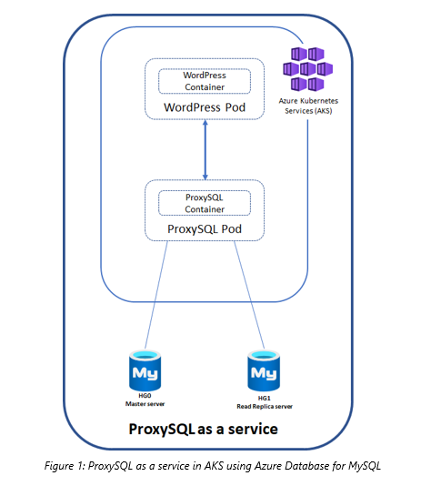

# Scaling a workload running on AKS with read replicas and ProxySQL for Azure Database for MySQL 

With Kubernetes, you can easily scale your application layer by simply adding nodes to your Kubernetes cluster or  scaling individual application pods that are essentially stateless. However, when scaling out a MySQL database, it may be limited by the maximum limits supported by a single node in Azure Database for MySQL. 

In this scenario, MySQL replication with the ProxySQL Load Balancer proxy can provide a more scalable design from a database perspective.  You can easily scale  Azure Database for MySQL with Read Replicas, and you can also use load balancer proxies to isolate and abstract your application from the complexity of database replication. In decentralized applications, it is common to use a load balancer to balance the workload and facilitate connection failover so that the application is  database topology independent. ProxySQL, a powerful MySQL proxy, allows users to send different requests to multiple servers to more efficiently distribute the load. ProxySQL has several advantages, including intelligent load balancing across different databases and the ability to detect if a database instance is running and redirect read traffic  accordingly.

The repo describes how to scale your WordPress application using ProxySQL deployed as service in Azure Kubernetes Service (AKS) to perform transparent read/write split across Azure Database for MySQL replicas.

## Deploy ProxySQL as a service
To deploy ProxySQL as a service, refer to [deploy ProxySQL as a service on Kubernetes using Azure Database for MySQL](https://github.com/manojgarg/proxySQL-Azure-MySql-AKS).

# Prepare the WordPress deployment
You can use the sample WordPress deployment file provided in the repo. Update the WordPress config details in the WordPress environment variables and the ProxySQL service details from the ProxySQL deployment you just performed.

# Setup
* Configure kubectl to use the credential for the AKS cluster created as part of deploying ProxySQL as a service. 
az aks get-credentials --name aks-cluster-name --resource-group "mydemo"​

* Deploy WordPress using the wordpress deployment file. 
kubectl create -f wordpress.yml​

* After the deployment finishes, can go to WordPress site by visiting the external IP. To get the external IPs, run the following command: 
kubectl get pods,services -o wide   ​